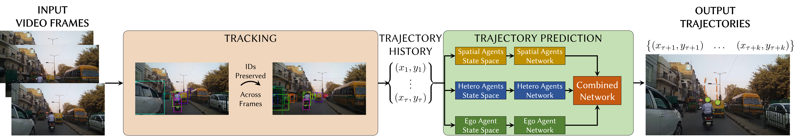
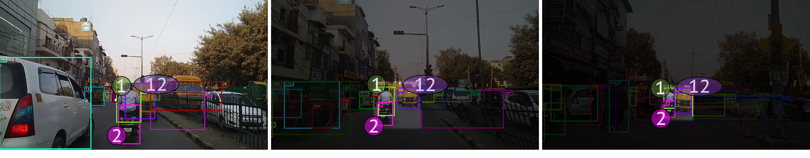
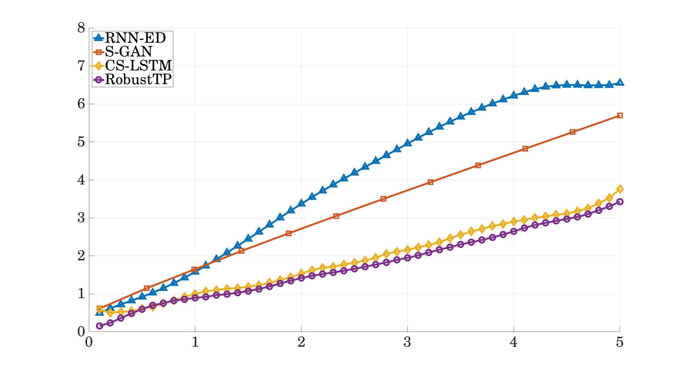
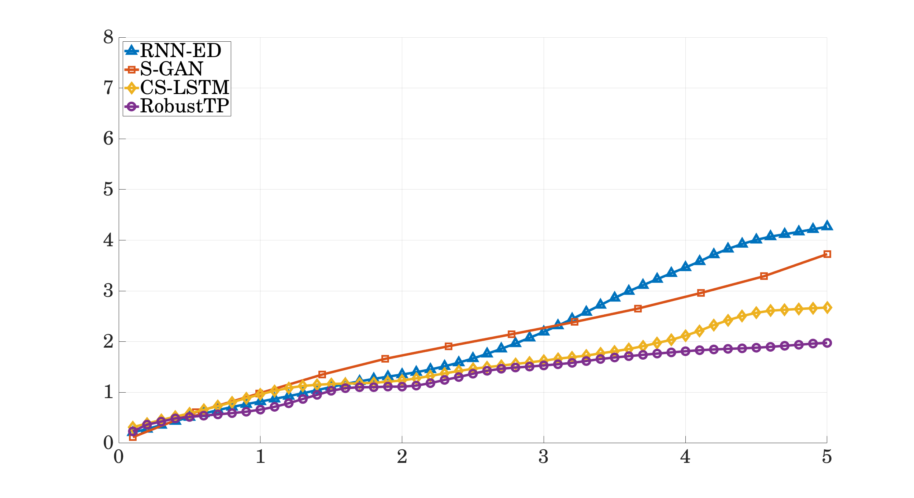

# TrackNPred: A Software Framework for End-to-End Trajectory Prediction

This is the code base for our ACM CSCS 2019 paper,

[**RobustTP: End-to-End Trajectory Prediction for Heterogeneous Road-Agents in Dense Traffic with Noisy Sensor Inputs**](https://arxiv.org/pdf/1907.08752.pdf). <br>
Rohan Chandra, Uttaran Bhattacharya, Christian Roncal, Aniket Bera, Dinesh Manocha

Please cite our work if you found this useful:

```
@article{chandra2019robusttp,
  title={RobustTP: End-to-End Trajectory Prediction for Heterogeneous Road-Agents in Dense Traffic with Noisy Sensor Inputs},
  author={Chandra, Rohan and Bhattacharya, Uttaran and Roncal, Christian and Bera, Aniket and Manocha, Dinesh},
  journal={arXiv preprint arXiv:1907.08752},
  year={2019}
}
```

## A Visualized Approach to Deep Learning


## Overview

We present RobustTP, an end-to-end algorithm for predicting future trajectories of road-agents in dense traffic with noisy sensor input trajectories obtained from RGB cameras (either static or mov-ing) through a tracking algorithm. In this case, we consider noise as the deviation from the ground truth trajectory. The amount of noise depends on the accuracy of the tracking algorithm. Our approach is designed for dense heterogeneous traffic, where the road agents corresponding to a mixture of buses, cars, scooters, bicycles, or pedestrians. RobustTP is an approach that first computes trajectories using a combination of a non-linear motion model and a deep learning-based instance segmentation algorithm. Next,these noisy trajectories are trained using an LSTM-CNN neural network architecture that models the interactions between road-agents in dense and heterogeneous traffic. We also release a software framework, TrackNPred. The framework consists of implementations of state-of-the-art tracking and trajectory predictionmethods and tools to benchmark and evaluate them on real-world dense traffic datasets



TrackNPred currently supports the following:

1. **Tracking by Detection:**
<ul>
<li> <a href="https://github.com/pjreddie/darknet/wiki/YOLO:-Real-Time-Object-Detection"> YOLO </a>+ DeepSORT  </li>
<li> <a href="https://github.com/matterport/Mask_RCNN"> Mask R-CNN </a>+ DeepSORT</li>
</ul>



2. **Trajectory Prediction**
<ul>
<li> <a href="https://arxiv.org/abs/1803.10892"> <b>Social GAN: Socially Acceptable Trajectories with Generative Adversarial Networks,</b> CVPR'18  </a><br>
Agrim Gupta, Justin Johnson, Fei-Fei Li, Silvio Savarese, Alexandre Alahi.
</li>
	
<li> <a href="https://arxiv.org/abs/1805.06771" ><b>Convolutional Social Pooling for Vehicle Trajectory Prediction,</b> CVPRW'18</a> <br>
Nachiket Deo and Mohan M. Trivedi.
</li>
<li> <a href="http://openaccess.thecvf.com/content_CVPR_2019/papers/Chandra_TraPHic_Trajectory_Prediction_in_Dense_and_Heterogeneous_Traffic_Using_Weighted_CVPR_2019_paper.pdf"> <b>TraPHic: Trajectory Prediction in Dense and Heterogeneous Traffic Using Weighted Interactions,</b> CVPR'19 </a><br>
Rohan Chandra, Uttaran Bhattacharya, Aniket Bera, Dinesh Manocha.
</li>
</ul> 

If you want to use TraPHic ONLY, then use [**this repository**](https://github.com/rohanchandra30/Spectral-Trajectory-Prediction) as it's easier.
	
## Dependencies
Support Python 3.5 and above. For a list of dependencies see requirements.txt

### Installing Dependencies:
1. Create a conda environement<br>
`conda create --name <env name e.g. tnp>`
2. Source into the environment<br>
`source activate <env name>`
3. Install the set of requirements<br>
`cd /path/to/requirements_file`<br>
`conda install --file requirements.txt`
<br>
Note that a lot of the requirements will not be installed by default. These need to installed manually as described later.

## Dataset
* Currently we only accept .mp4 file. 
* The mp4 file must consist of a string and a number after that string.
* We need to create a folder that has the same name as the video file and put the video in that folder. 
* The datafolder needs to exist in the Direcotry specified in the GUI/commandline.<br>
	Example: if the data directory is `resources/data/TRAF`, and the video name is `TRAFx.mp4`, then the location of the video should be `resources/data/TRAF/TRAFx/TRAFx.mp4`.
* Note that currently, all the data has to reside inside `resources/data`.
* All of the files generated will be in the corresponding datafolder.

## Usage
1. Inside the conda environment, run `python setup.py` to get resources folder containing dataset and model weights.
2. . Try to run `python main.py`. It will run into an error stating that a dependency was not found.
3. Manually install the dependency with `conda install DEPENDENCY` (occasionally with `conda install -c CHANNEL DEPENDENCY`, where the channel name can be found by searching for the dependency file in the [Anaconda cloud](https://anaconda.org/)).
4. Repeat Steps 2-3 till all dependency issues are resolved and the GUI opens.
5. We provide the options of GUI and command line control:<br>
	Examples:
	* Run `python main.py` to get the GUI, which will give you the options you can choose.
	* Run `python main_cmd.py -l 11 -l 12` to run dataset TRAF11 and TRAF12 in command line.
	* Run `python main_cmd.py -l 11 --detection False --tracking False --train True --eval True` to only run prediction training and evaluating on dataset TRAF11 in command line.
		* `-l` is required. It takes in a series of numbers and specifies which dataset you want to run. 
		* Other flags are not required, but you can play around the options that was provided in the GUI. Please see how they are defined in the [main_cmd.py](main_cmd.py) file.


## Results
Our trajectory prediction algorithm outperforms state-of-the-art methods for end-to-end trajectory prediction using sensor inputs. We achieve an improvementof upto 18% in average displacement error and an improvement of up to 35.5% in final displacement error at the end of the prediction window (5 seconds) over the next best method. All experiments were set up on an Nvidia TiTan Xp GPU.

We evaluate RobustTP with methods that use manually annotated trajectory histories, on the TRAF Dataset. The results are reported in the following format: ADE/FDE, where ADE is the average displacement RMSE over the 5 seconds of prediction and FDE is the final displacement RMSE at the end of 5 seconds. We observe that RobustTP is at par with the stat-of-the-art:
	
| RNN-ED    | S-GAN  |CS-LSTM | TraPHic|RobustTP|
| ---        |    ----   |  ----   |----   |----   |
|3.24/5.16 | 2.76/4.79 | 1.15/3.35 | **0.78/2.44** | 1.75/3.42|

We also evaluate RobustTP using trajectory histories that are computed by two detection methods: Mask R-CNN and YOLO:

Using Mask R-CNN            |  Using YOLO
:-------------------------:|:-------------------------:
  |  

### TrackNPred is developed and maintained by-
1. [**Tianrui Guan**](https://www.linkedin.com/in/tianrui-guan-b76733ba/detail/contact-info/).
2. [**Christian Roncal**](https://github.com/christian-rncl).
